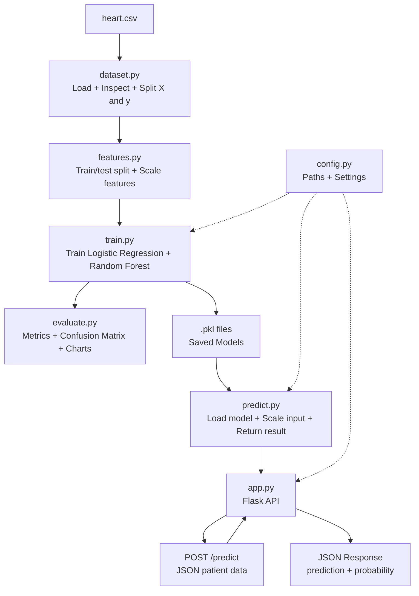

# Project 1 — Architecture Diagram

```mermaid
flowchart TD
    A[heart.csv] --> B[dataset.py\nLoad + Inspect + Split X and y]
    B --> C[features.py\nTrain/test split + Scale features]
    C --> D[train.py\nTrain Logistic Regression + Random Forest]
    D --> E[evaluate.py\nMetrics + Confusion Matrix + Charts]
    D --> F[.pkl files\nSaved Models]
    F --> G[predict.py\nLoad model + Scale input + Return result]
    G --> H[app.py\nFlask API]
    H --> I[POST /predict\nJSON patient data]
    I --> H
    H --> J[JSON Response\nprediction + probability]
    K[config.py\nPaths + Settings] -.-> D
    K -.-> G
    K -.-> H
```